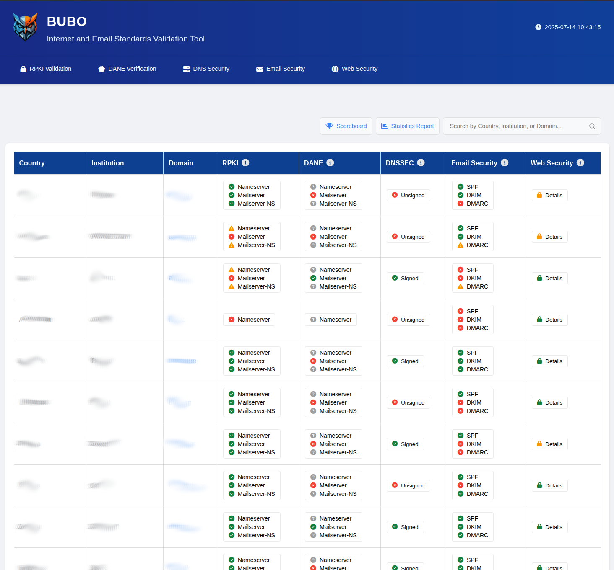
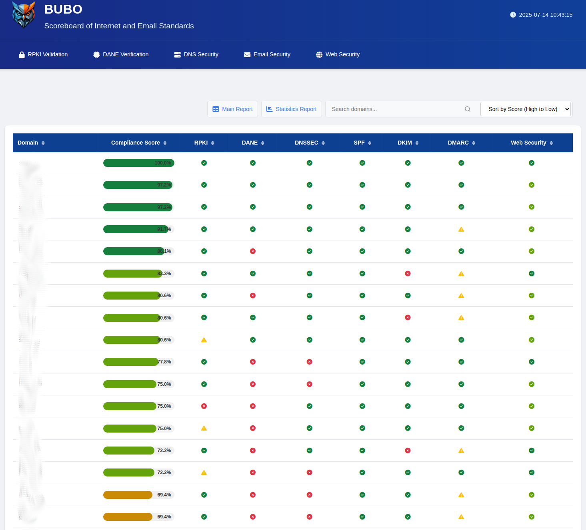
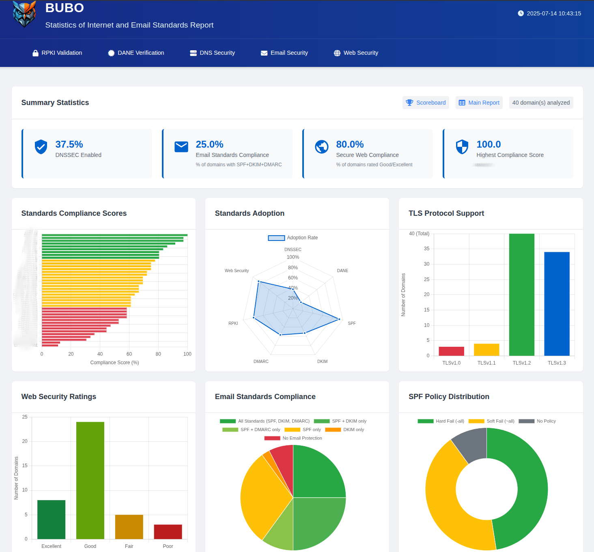
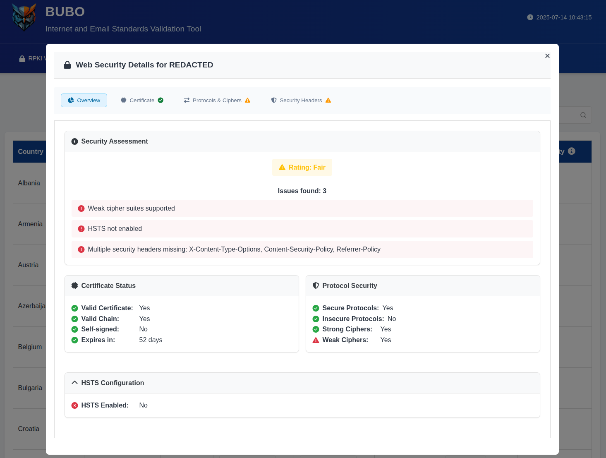
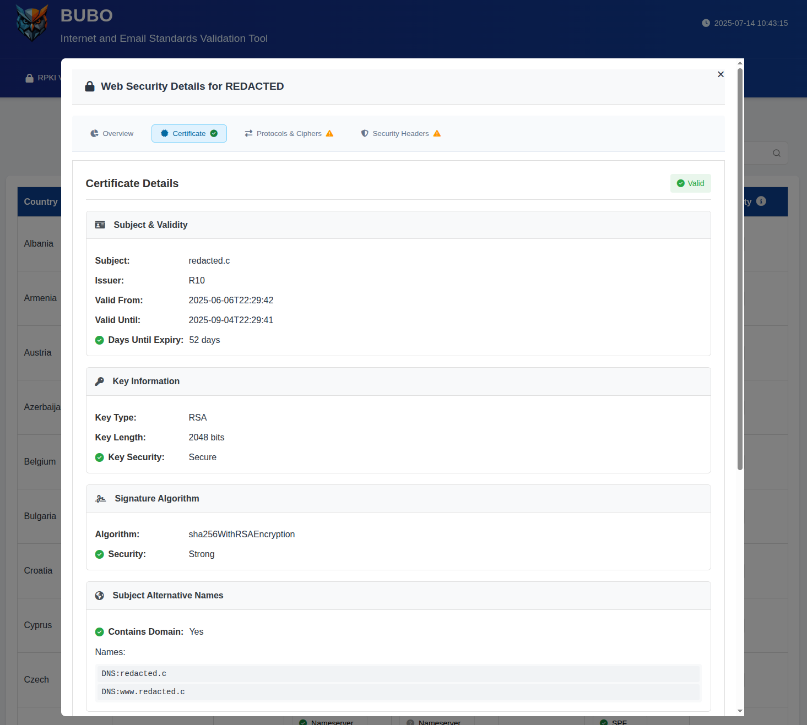
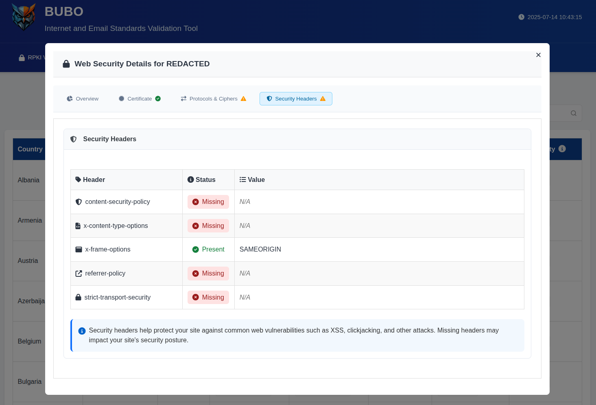
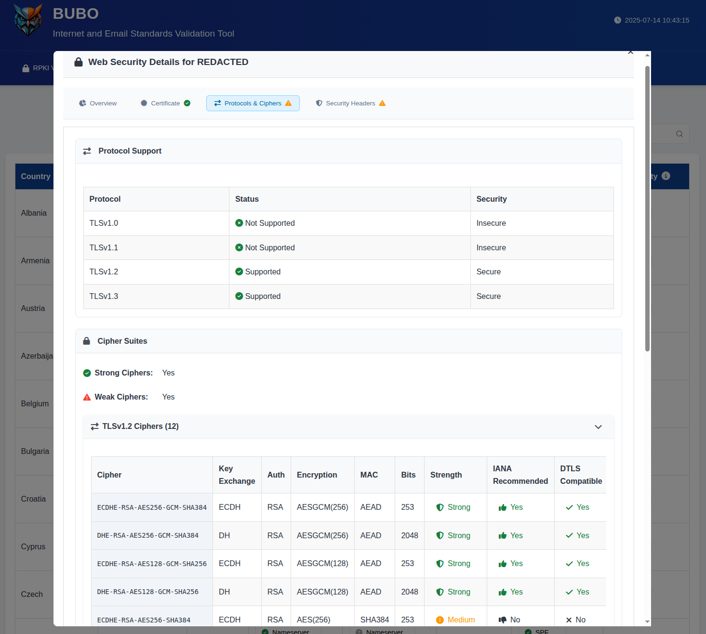

# BUBO Screenshots

This document contains screenshots of the BUBO Internet and Email Standards Validation Tool interface.

## Main Interface

The main validation interface where users can input domains and view comprehensive security assessments:

## Scoreboard View

The scoreboard displays a comparative ranking of domains based on their security compliance scores:

## Statistics Dashboard

Comprehensive statistics and analytics view showing trends and metrics across all validated domains:

## Web Security Features

### Overview

General web security assessment overview:

### Certificate Information

Detailed SSL/TLS certificate validation and information:

### Security Headers

HTTP security headers analysis and recommendations:

### Protocols and Ciphers

TLS protocol and cipher suite analysis:

